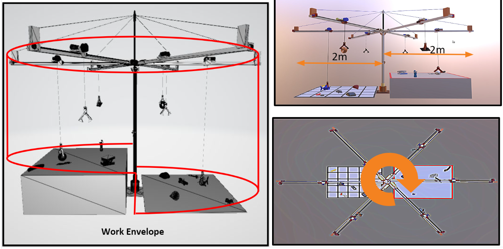

# Flipkart-Grid-2.0
# PROTOTYPE DIMENSIONS

1. Drive link for 3D file(Prototype)
-> https://drive.google.com/file/d/1GaTQG30a9l_nvpGqLNhT8WhnDX53xWw4/view

2. Drive link for 3D Simulation video of Prototype 
-> https://drive.google.com/file/d/1TaWkiyUXwatIianEqWdjaD5C8D1h9qFd/view

3. Drive link for Object Recognition video
-> https://drive.google.com/file/d/11Ib3Yb5RoFCpj0rxp0O_OQts7TEK8zBd/view

4. Drive link for 3D file (Gripper) 
-> https://drive.google.com/file/d/1DC3MfUVnu2Fm370iGdKt6as4AthnwfYI/view

5. Drive link for working Soft Grippers (Video Clip) 
-> https://drive.google.com/file/d/1AHO5AwZlEe_oicbnOhwM0GI5V0sIrBpW/view

Software used for protype designing and animation - Blender

# OUR APPROACH
• Our object detection model will detect the position of object from the feed taken by the camera and then the
position of objects is calculated in terms of the angle from the closest arm and its distance from axle.

• After the required calculation, the main axle rotates by the desired angle and when the arm is above the
object, the grabber moves until it reaches the top of the object. After that the grabbers come down and pick
the object from the top in the upright position as the object was placed. And this process continues.

• While dropping, the cameras detect the position where the object is to be placed and when it reaches the top
of it, the grabber moves down and places the object.

• These picking and placing processes take place simultaneously and the model automatically chooses the
more feasible process.

• When the count of initial objects on the picking area equals current objects in drop area, then the process
